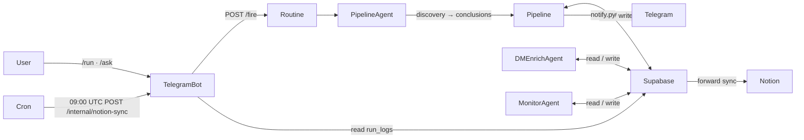
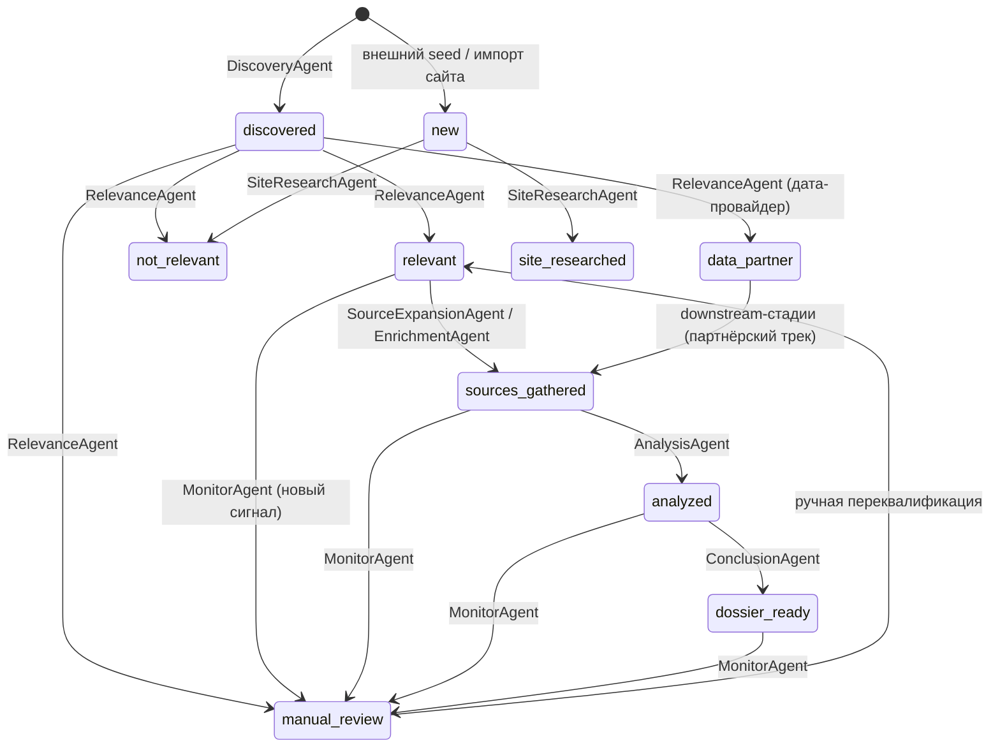
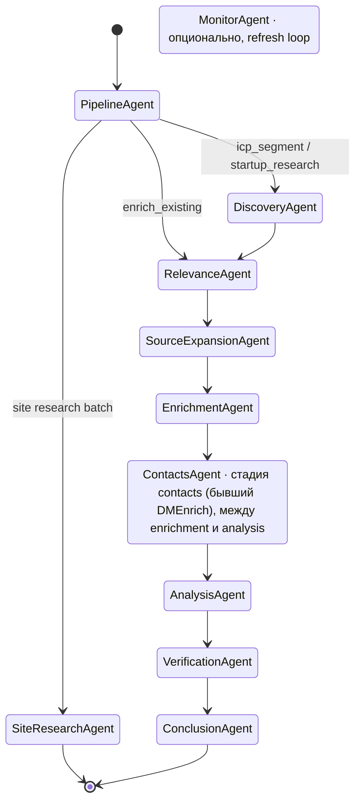
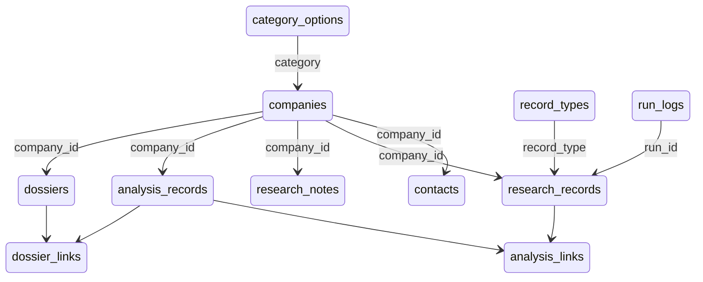
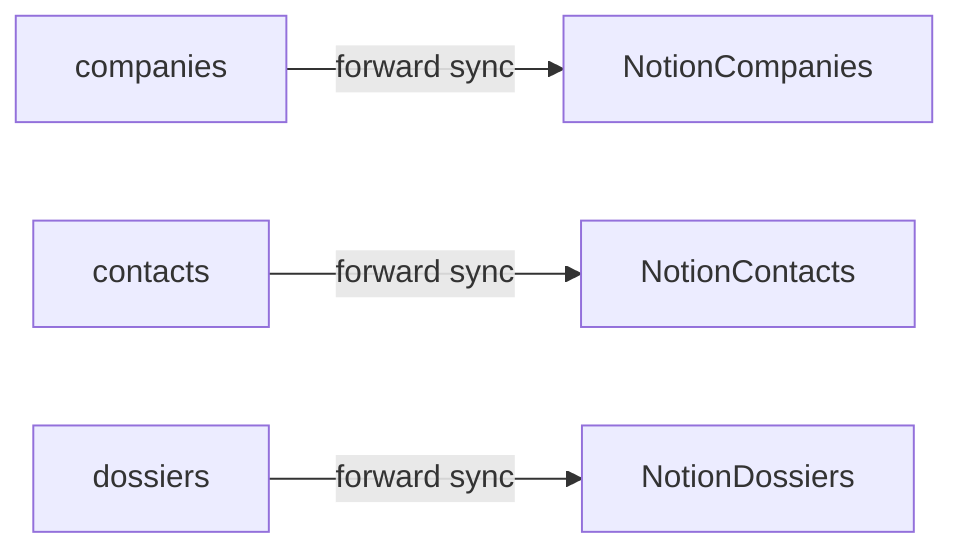

# Kvetio Agent — Architecture

Источник истины по архитектуре проекта.
Читать перед любыми изменениями. Обновлять после любых изменений.

---

## Навигация

<details>
<summary><b>1. Общая структура проекта</b></summary>

- [Схема системы](#1-общая-структура-проекта)
- [Ключевые принципы](#ключевые-принципы)

</details>

<details>
<summary><b>2. Бот и запуск</b></summary>

- [Команды бота](#команды-бота)
- [/run wizard](#run-wizard)
- [/ask NLP](#ask-nlp)
- [Сценарии и режимы](#сценарии-и-режимы)
- [Деплой Railway](#деплой-railway)
- [Регистрация Telegram Webhook](#регистрация-telegram-webhook)
- [Claude Code Routine — настройка](#claude-code-routine--настройка)
- [Переменные окружения](#переменные-окружения)
- [Параметры запуска Routine](#параметры-запуска-routine)

</details>

<details>
<summary><b>3. Агенты и скрипты</b></summary>

- [Статусный flow компаний](#статусный-flow-компаний)
- [Пайплайн агентов](#пайплайн-агентов)
- [PipelineAgent](#pipelineagent)
- [DiscoveryAgent](#discoveryagent)
- [RelevanceAgent](#relevanceagent)
- [SiteResearchAgent](#siteresearchagent)
- [SiteResearchAgent (Relevant Track)](#siteresearchagent-relevant-track)
- [SourceExpansionAgent](#sourceexpansionagent)
- [EnrichmentAgent](#enrichmentagent)
- [AnalysisAgent](#analysisagent)
- [ConclusionAgent](#conclusionagent)
- [DMEnrichAgent](#dmenrichagent)
- [NewsAgent](#newsagent)
- [MonitorAgent](#monitoragent)

</details>

<details>
<summary><b>4. База данных</b></summary>

- [Схема таблиц](#схема-таблиц)
- [category\_options](#category_options)
- [companies](#companies)
- [research\_records](#research_records)
- [research\_notes](#research_notes)
- [contacts](#contacts)
- [analysis\_records](#analysis_records)
- [analysis\_links](#analysis_links)
- [dossiers](#dossiers)
- [dossier\_links](#dossier_links)
- [record\_types](#record_types)
- [run\_logs](#run_logs)

</details>

<details>
<summary><b>5. Notion</b></summary>

- [Роль Notion в системе](#роль-notion-в-системе)
- [Что и когда синхронизируется](#что-и-когда-синхронизируется)
- [Триггеры синхронизации](#триггеры-синхронизации)
- [Конфигурация](#конфигурация)
- [Как добавить новое поле в Notion](#как-добавить-новое-поле-в-notion)
- [Правила Notion](#правила-notion)

</details>

---

## 1. Общая структура проекта



### Ключевые принципы

- **Бот не выполняет pipeline-логику.** Он только собирает параметры и вызывает `/fire`. Прямого доступа к Notion у бота нет.
- **Routine не общается с пользователем напрямую** — только через `notify.py` → Telegram.
- **Supabase — единственный источник истины.** Notion не авторитетна: при конфликте доверять Supabase.
- **Каждая сущность привязана к компании.** Все FK ссылаются на `companies.id` (UUID); ни одна запись не живёт без компании.
- **Синхронизация с Notion строго односторонняя:** Supabase → Notion.

---

## 2. Бот и запуск

Бот — FastAPI-приложение (`bot/gateway.py`) на Railway, принимающее Telegram webhook-запросы. Единственная задача бота — принять команду пользователя, при необходимости провести диалог для уточнения параметров, и вызвать `/fire` на Routine. Вся бизнес-логика выполняется в Routine, а не в боте.

### Команды бота

| Команда | Роль |
|---|---|
| `/start` | Описание бота |
| `/help` | Все команды |
| `/ping` | Проверка доступности |
| `/whoami` | Текущий chat_id |
| `/status` | Активный ран (`finished_at IS NULL` в `run_logs`) |
| `/last [n]` | Последние n запусков (default 5, max 20) |
| `/run` | 5-шаговый мастер с inline-кнопками |
| `/refill` | Мастер дозаполнения существующих компаний (без discovery) |
| `/ask <текст>` | NLP-запуск через Gemini Flash |
| `/digest [n]` | Дайджест лидов |
| `/hot [n]` | Компании с высоким icp_fit |
| `/stale [n]` | Компании в очереди на проверку |
| `/notion_sync` | Принудительная синхронизация с Notion |
| `/settings` | Справка по настройкам (алиас `/help`) |

Обработчики команд — `bot/gateway.py`; диалоговые мастера — `bot/dialog.py`; вызов Routine — `bot/routine.py`.

### /run wizard

5-шаговый диалог с inline-кнопками (`bot/dialog.py`). Весь стейт кодируется в `callback_data` каждой кнопки (compact encoding ≤64 байт) — session state не хранится на сервере. Каждый шаг редактирует то же сообщение в Telegram.

1. **Сегменты** — мультиселект из 7 ICP-сегментов.
2. **Лимит** — 5 / 10 / 30 компаний на сегмент.
3. **Стадии** — полный pipeline или подмножество.
4. **Флаги** — `dry_run`, `notion_sync`.
5. **Подтверждение** → вызов `/fire` с собранными параметрами.

### /ask NLP

Свободный текст → Gemini Flash (`bot/intent_agent.py`) → `ParsedIntent`. Если `missing_fields` не пусто и уточнений ещё меньше трёх — бот задаёт уточняющий вопрос (state=`clarifying`). После заполнения всех полей — подтверждение → `/fire`.

Используемая модель: `GEMINI_MODEL` (по умолчанию `gemini-2.0-flash-lite`).

### Сценарии и режимы

Сценарий = режим запуска (`mode`). Определены в `bot/scenarios.py` как `ScenarioSpec` с набором стадий, обязательными полями и дефолтами. Значение `mode` передаётся в `/fire` и определяет, какие стадии запустит PipelineAgent.

| `mode` | Назначение | Обязательные поля | Стадии по умолчанию |
|---|---|---|---|
| `icp_segment` | Поиск новых компаний по сегментам из `config/icp.yaml` | `segments` | `full` |
| `single_company` | Полный pipeline для одной компании | `company_name` | `full` |
| `startup_research` | Исследование по свободному описанию | `description` | `full` |
| `enrich_existing` | Pipeline без discovery для компаний уже в БД | — | `relevance, source_expansion, enrichment, analysis, conclusions` |
| `news_lead` | Точечный pipeline (без discovery) для одной компании, заведённой NewsAgent из новости | `domain` | `relevance, source_expansion, enrichment, analysis, conclusions` |

Параметры и дефолты каждого режима — в [Параметрах запуска Routine](#параметры-запуска-routine).

`news_lead` — это `enrich_existing`, суженный до одной компании по `domain`:
discovery пропущена (NewsAgent уже сыграл её роль), RelevanceAgent остаётся
финальным ICP-гейтом. Определён в `bot/scenarios.py` и `bot/config.py`.

### Деплой Railway

Railway деплоит бота автоматически при push в git (builder: nixpacks).

**Стартовая команда:** `uvicorn bot.gateway:app --host 0.0.0.0 --port $PORT`

**Health check:** `GET /healthz` → `{"status": "ok"}`

**Cron `notion-sync-cron`** запускается ежедневно в 09:00 UTC → `POST /internal/notion-sync`. Защищён заголовком `Authorization: Bearer $SYNC_SECRET`.

**Локальный запуск:**
```bash
uvicorn bot.gateway:app --host 0.0.0.0 --port 8000
curl localhost:8000/healthz
```

### Регистрация Telegram Webhook

Запустить один раз после деплоя (скрипт идемпотентен — пропускает, если webhook уже на нужном URL):
```bash
python -m bot.set_webhook
```

Проверить текущий webhook:
```bash
curl "https://api.telegram.org/bot<TOKEN>/getWebhookInfo"
```

Установить вручную:
```bash
curl -X POST "https://api.telegram.org/bot<TOKEN>/setWebhook" \
  -H "Content-Type: application/json" \
  -d '{
    "url": "https://<app>.up.railway.app/telegram/webhook",
    "secret_token": "<TELEGRAM_WEBHOOK_SECRET>",
    "allowed_updates": ["message", "callback_query"]
  }'
```

Удалить (для локальной разработки через polling):
```bash
curl "https://api.telegram.org/bot<TOKEN>/deleteWebhook"
```

Каждый входящий запрос от Telegram содержит заголовок `X-Telegram-Bot-Api-Secret-Token`. Бот проверяет его в `_verify_webhook_secret()`. Если не совпадает — 403.

### Claude Code Routine — настройка

1. Открыть [claude.ai/code](https://claude.ai/code) → **Routines**.
2. Создать Routine → задать имя (`kvetio-pipeline`).
3. Подключить репозиторий через GitHub.
4. В **Bootstrap Prompt** вставить содержимое `agents/prompts/pipeline_task.md`.
5. В **Environment Variables** добавить все переменные из блока "Routine" ниже.
6. В **Network Access** разрешить: `supabase.co`, `api.telegram.org`, `api.notion.com`, `api.github.com`, `huggingface.co`.
7. **API Trigger** → **Generate Token** → скопировать как `ROUTINE_TOKEN`.
8. Скопировать URL `/fire` → это `ROUTINE_FIRE_URL`.
9. Оба значения добавить в переменные окружения Railway.

> `ROUTINE_TOKEN` нельзя придумать вручную — только генерировать через UI. При компрометации — перегенерировать и обновить в Railway.

### Переменные окружения

**Railway (бот):**

| Переменная | Назначение |
|---|---|
| `SUPABASE_URL`, `SUPABASE_KEY` | Supabase |
| `TELEGRAM_BOT_TOKEN` | Токен бота от @BotFather |
| `TELEGRAM_WEBHOOK_SECRET` | Секрет верификации webhook-запросов |
| `BOT_WEBHOOK_URL` | `https://<app>.up.railway.app/telegram/webhook` |
| `ROUTINE_FIRE_URL` | URL `/fire` из claude.ai/code |
| `ROUTINE_TOKEN` | Bearer-токен API-trigger из claude.ai/code |
| `GEMINI_API_KEY` | Google AI Studio (для `/ask` NLP) |
| `GEMINI_MODEL` | По умолчанию `gemini-2.0-flash-lite` |
| `SYNC_SECRET` | Секрет для `/internal/notion-sync` |
| `BOT_INTERNAL_URL` | Internal URL бота для cron |
| `KVETIO_LOG_LEVEL` | По умолчанию `INFO` |

**Claude Code Routine:**

| Переменная | Назначение |
|---|---|
| `SUPABASE_URL`, `SUPABASE_KEY` | База данных |
| `TELEGRAM_BOT_TOKEN`, `TELEGRAM_CHAT_ID` | Итоговые сводки через `notify.py` |
| `NOTION_TOKEN` | Internal integration token (notion.so/my-integrations) |
| `NOTION_COMPANIES_DB_ID` | ID базы компаний в Notion |
| `NOTION_CONTACTS_DB_ID` | ID базы контактов в Notion |
| `NOTION_DOSSIERS_DB_ID` | ID базы досье в Notion |
| `GITHUB_TOKEN` | GitHub API |
| `HF_TOKEN` | HuggingFace (расширяет лимиты до ~1000 req/min) |
| `SITE_FETCH_MAX_OUTPUT` | Лимит символов вывода `scripts/site_fetch.py`, по умолчанию `50000` |
| `SITE_FETCH_MAX_PAGES` | Лимит подстраниц для SiteResearchAgent, по умолчанию `5` |
| `APOLLO_API_KEY` | Опционально, contacts adapter |

### Параметры запуска Routine

Бот передаёт параметры в поле `text` при вызове `/fire`. Это строка `key=value`, разделённая `;`. PipelineAgent парсит её в шаге 0 и **никогда не воспринимает как свободный текст**.

```
mode=icp_segment; segments=medical-imaging,robotics-ai; limit=5; stages=full; dry_run=false; notion_sync=true
```

| Параметр | Значения | По умолчанию |
|---|---|---|
| `mode` | `icp_segment`, `single_company`, `startup_research`, `enrich_existing`, `news_lead` | `icp_segment` |
| `domain` | один домен (только для `news_lead`) | — |
| `segments` | CSV из валидных сегментов | все из `config/icp.yaml` |
| `limit` / `limit_per_segment` | 1–200 | `5` (для `enrich_existing` — `30`) |
| `stages` | `full` или CSV стадий | `full` |
| `dry_run` | `true` / `false` | `false` |
| `notion_sync` | `true` / `false` | `true` |

**Логика `limit`:** максимум компаний на сегмент на каждой стадии независимо. При `limit=5` и 3 сегментах — до 15 компаний на стадии. В мастере `/run` доступны пресеты `5 / 10 / 30` (`bot/dialog.py::LIMIT_PRESETS`).

**Логика `stages`:** `full` → все 6 стадий в фиксированном порядке. Subset (`stages=relevance,analysis`) → только эти, в том же порядке. Порядок иммутабельный: `discovery → relevance → source_expansion → enrichment → analysis → conclusions` (`bot/config.py::VALID_STAGES`).

**Валидные сегменты:** `medical-imaging`, `autonomous-vehicles`, `speech-and-audio`, `generative-ai`, `agriculture-ai`, `robotics-ai`, `video-photo-ai`. Определены в `bot/config.py::VALID_SEGMENTS`.

Описание режимов — в [Сценариях и режимах](#сценарии-и-режимы).

---

## 3. Агенты и скрипты

Все агенты — prompts в `agents/prompts/`. PipelineAgent читает `pipeline_main_task.md` при каждом запуске напрямую из git (не из bootstrap). Это означает, что изменения в промпте применяются на следующем запуске без переконфигурации Routine.

> Активные промпты пайплайна перечислены ниже в блоках агентов. Файлы `collection_task.md`, `research_task.md`, `discover_verify_task.md`, `verify_task.md`, `retroactive_pipeline_task.md` — легаси и в текущем пайплайне не вызываются (остаются до завершения чистки `agents/prompts/`).

### Статусный flow компаний



Статус только повышается в рамках пайплайна. Понижать нельзя. Добавлять новые статусы нельзя без изменения `CHECK` constraint в `sql/schema.sql`.

`data_partner` — исход Relevance для компаний, которые сами продают датасеты/разметку (партнёрский трек вместо `not_relevant`). Downstream-стадии выбирают `relevant` И `data_partner`. Так как статус только повышается, партнёрская принадлежность дополнительно фиксируется durable-записью `research_records` с `record_type='data_partner_flag'` — по ней downstream-агенты и Аудит определяют трек, а не по текущему статусу.

`new` → `site_researched` — отдельный терминальный pipeline SiteResearchAgent.
Он не трогает `research_records` и не продолжает основной discovery→dossier flow:
результаты сайта пишутся в `contacts`, `research_notes` и поля `companies`.

### Пайплайн агентов



---

### PipelineAgent

**Промпт:** `agents/prompts/pipeline_main_task.md`

**Роль:** Оркестратор. Не выполняет бизнес-логику — только координирует стадии.

**Как работает:** парсит `text=` из `/fire` (ключи `mode`, `segments`, `limit`, `stages`, `dry_run`, `notion_sync`), читает `config/icp.yaml`, проверяет Supabase, запускает стадии последовательно, собирает финальную сводку.

**Пишет в БД:** `run_logs` (start/finish, ошибки, статистика).

**Скрипты:** `supabase_store.py --coverage`, `notify.py --run-summary`.

**Правило:** неизвестные ключи в `text=` игнорировать. Ошибка одного сегмента не останавливает весь pipeline.

---

### DiscoveryAgent

**Промпт:** `agents/prompts/discovery_task.md`

**Роль:** Находит новые компании-кандидаты по ICP-сегменту. Не принимает решений о релевантности — только фиксирует факт нахождения.

**Как работает:** запускает source adapters по параметрам сегмента, нормализует домен через `normalize.py`, делает upsert по `domain`. Для каждой принятой компании пишет компанию и первичный `research_record`.

**Источники данных:**
- `scripts/huggingface.py` — организации и модели HuggingFace Hub.
- `scripts/yc_browser.py` — компании из YC batch.
- `scripts/github.py` — репозитории и организации GitHub.
- `scripts/greenhouse.py`, `scripts/lever.py` — job postings через ATS (`lever` по умолчанию выключен).
- Активность каждого источника (`enabled`) и его параметры — в `config/sources.yaml`.

**Пишет в БД:**
- `companies`: `domain`, `name`, `website`, `icp_segment`, `status='discovered'`.
- `research_records`: `record_role='primary'`, `url`, `confidence`, `dedupe_key`.

**Читает из БД:** `companies.domain` — проверка дублей перед upsert.

---

### RelevanceAgent

**Промпт:** `agents/prompts/relevance_task.md`

**Роль:** Квалифицирует компании: релевантные, нерелевантные, требующие ручной проверки, дата-партнёры.

> **Phase 1:** добавлен исход `data_partner` — компании, которые сами продают датасеты/разметку, идут в партнёрский трек, а не в `not_relevant`. Relevance ставит статус `data_partner` И пишет durable-запись `research_records` с `record_type='data_partner_flag'`.

**Как работает:**
1. **Quick Filter** — открывает сайт компании через WebFetch. Вопрос: разрабатывает ли компания собственные AI/ML модели или tooling, а не просто использует чужой API? Признаки: обучение моделей, fine-tuning, ML вакансии, публичные модели, научные публикации.
2. **Глубокая верификация** — для прошедших Quick Filter: HuggingFace org, LinkedIn, funding. Каждый найденный факт → `research_records` с `record_role='verification'`.
3. Принимает решение и обновляет статус.

**Пишет в БД:**
- `companies`: `status`, `description`, `linkedin_url`.
- `research_records`: `record_role='verification'` для каждого найденного доказательства.
- `run_logs`: итог стадии.

**Читает из БД:** `companies WHERE status='discovered'`.

**Источники данных:** WebFetch (сайт компании), HuggingFace API, GitHub, LinkedIn.

---

### SiteResearchAgent

**Промпты:** `agents/prompts/site_research_task.md` +
`agents/prompts/relevance_check_task.md`.

**Роль:** Терминальный разбор сайта для компаний со статусом `new`. Агент
скрапит сайт, запускает вложенную проверку релевантности, классифицирует
категорию компании и записывает найденные контакты/заметки/firmographics.

**Как работает:**
1. Берёт `companies WHERE status='new'`.
2. Запускает `python scripts/site_fetch.py --domain <domain> --max-pages <N>`.
   Скрипт использует `agent-browser` CLI, если он установлен, иначе fallback
   `httpx` + BeautifulSoup.
3. Передаёт JSON сайта во вложенный `relevance_check_task.md`.
4. Для нерелевантных компаний ставит `not_relevant` и `category`, без записи
   контента.
5. Для релевантных пишет контакты, заметки, `category`, `founded_year`,
   `country`, затем ставит `site_researched`.

**Пишет в БД:**
- `companies`: `status`, `category`, `founded_year`, `country`.
- `contacts`: people/company channels через `contacts_store.upsert_contact`.
- `research_notes`: `product`, `press_release`, `cooperative`, `finance`.
- `category_options`: новые category select options через `ensure_category`.
- `run_logs`: итог запуска.

**Читает из БД:** `companies WHERE status='new'`.

**Скрипты:** `scripts/site_fetch.py`, `scripts/research_notes_store.py`,
`scripts/contacts_store.py`, `scripts/notify.py`.

**Граница:** это параллельный pipeline. Он не пишет в `research_records` и не
переводит компании в `sources_gathered`/`analyzed`/`dossier_ready`.

### SiteResearchAgent (Relevant Track)

**Промпт:** `agents/prompts/site_research_for_relevant_task.md`.

**Роль:** Обогащение уже квалифицированных `relevant` компаний через скрейпинг их сайтов. Собирает контакты, информацию о продукте, год основания и страну.

**Как работает:**
1. Берёт `companies WHERE status='relevant'` (макс 20).
2. Запускает `python scripts/site_fetch.py --domain <domain> --max-pages 5`.
3. Парсит результат: ищет контакты (люди, email, социальные ссылки), описание продукта, год основания, страну.
4. Записывает контакты через `contacts_store.upsert_contact`.
5. Записывает product notes через `research_notes_store.upsert_note`.
6. Обновляет `founded_year` и `country` в таблице `companies`.

**Пишет в БД:**
- `companies`: `founded_year`, `country` (статус НЕ меняется).
- `contacts`: люди и каналы связи.
- `research_notes`: product информация (`note_type="product"`).
- `run_logs`: итоговая статистика.

**Читает из БД:** `companies WHERE status='relevant'`.

**Скрипты:** `scripts/site_fetch.py`, `scripts/research_notes_store.py`, `scripts/contacts_store.py`.

**Отличие от основной SiteResearchAgent:** не проверяет релевантность (компании уже квалифицированы), не меняет статус, не работает с `category_options`. Идемпотентна.

---

### SourceExpansionAgent

**Промпт:** `agents/prompts/source_expansion_task.md`

**Роль:** Собирает набор курированных URL-источников для последующего анализа. Не интерпретирует данные.

**Как работает:** для каждой `relevant` компании ищет дополнительные источники через поиск и WebFetch: официальный сайт, GitHub, HuggingFace, новости, документацию, блог. Каждую ссылку пишет в `research_records` с `record_role='source'`. Переводит компанию в `sources_gathered`.

**Пишет в БД:**
- `research_records`: `record_role='source'` или `'verification'`.
- `companies`: `status='sources_gathered'`.

**Читает из БД:** `companies WHERE status='relevant'`.

---

### EnrichmentAgent

**Промпт:** `agents/prompts/enrichment_task.md`

**Роль:** Запускает детерминированные резолверы для поиска структурированных источников. Не интерпретирует — только находит и сохраняет URL.

**Как работает:** запускает `enrichment.py --domain` — скрипт автоматически находит HuggingFace org, Wikidata, news feeds, social links. Добирает вручную через WebSearch то, чего не нашёл скрипт.

**Резолверы (`scripts/enrichment.py`):** `GithubOrgResolver`, `WaybackResolver`, `ArxivResolver`, `PapersWithCodeResolver`, `WikidataResolver`, `OpenCorporatesResolver` (Phase 3) и финансовые резолверы Phase 1 — `SecEdgarResolver` (Form D → `form_d`), `SbirGrantsResolver` (SBIR.gov → `grant`), `GdeltFundingResolver` (GDELT funding-news → `funding_announcement`), `MarketDataResolver` (Stooq CSV → `market_quote`, только если известен тикер; Phase 3, опционально). Каждый резолвер возвращает link-dict; `run_enrichment` пишет `research_records` с `record_type` из `link['record_type']` (по умолчанию `source_link`). Активность резолвера определяется его атрибутом `enabled`; `config/sources.yaml` — документирующий реестр. Платные стабы (`linkedin`, `crunchbase`, `similarweb`) выключены.

**Пишет в БД:**
- `research_records`: `record_role='source'`, тип из словаря `record_types`.
- `companies`: `status='sources_gathered'`.

**Читает из БД:** `companies WHERE status='relevant'`.

**Скрипты:** `scripts/enrichment.py --domain <domain>`.

> **Взаимодействие с SourceExpansionAgent.** Обе стадии читают `relevant` и переводят в `sources_gathered`. В `full`-прогоне source_expansion идёт первой и забирает все `relevant`-компании — поэтому enrichment реально срабатывает, когда source_expansion пропущен (subset `stages`) или когда часть компаний осталась в `relevant`. Стадии дополняют друг друга: source_expansion ищет источники через поиск/WebFetch, enrichment — через детерминированные резолверы.

---

### AnalysisAgent

**Промпты:** `agents/prompts/analysis_task.md` + `analysis_section_task.md` + `analysis_audit_task.md`

**Роль:** Читает все собранные источники и пишет структурированную интерпретацию по секциям.

**Как работает:**
1. Берёт компании `sources_gathered`, читает все `research_records`.
2. Для каждой из 5 секций запускает `analysis_section_task.md` — разделяет claims и verified facts, сохраняет URL-источники.
3. Запускает `analysis_audit_task.md` — секция `audit`, оценка рисков и пробелов.
4. Каждую секцию пишет как строку `analysis_records`.
5. Записывает `analysis_links` — какие `research_records` поддерживают каждый вывод.

**Секции:** `company`, `product`, `collaboration`, `financials`, `news`, `audit`.

**Пишет в БД:**
- `analysis_records`: `section`, `facts` (JSONB), `confidence`, `model`, `version`.
- `analysis_links`: `analysis_record_id → research_record_id`, role `supports/contradicts/context`.
- `companies`: `status='analyzed'`.

**Читает из БД:** `research_records` компании (все роли).

**Скрипты:** `scripts/dossier_store.py --upsert-analysis-record`.

---

### VerificationAgent

**Промпт:** `agents/prompts/verification_task.md`

**Роль:** Гейт качества между Analysis и Conclusions (Phase 2). Отсекает несвежие и
неподтверждённые данные, чтобы в досье как факт попадало только проверенное. Статус
компании не меняет.

**Как работает:** для компаний `analyzed` запускает `scripts/verification.py --domain`:
- **свежесть** — пороги в `config/verification.yaml` (новость > 12 мес или финансовый
  сигнал > 18 мес → `stale`);
- **живость ссылки** — HEAD-запрос; 404 / только-Wayback → `unverified`.
Каждый `research_record` получает `payload.verification = verified | unverified | stale`
(через `SupabaseStore.set_record_verification`, без новой колонки). Мягкую проверку
(claim↔fact, match по имени) делает агент по промпту.

**Стадия:** `verification` в `VALID_STAGES` (`bot/config.py`), порядок —
между `analysis` и `conclusions` (`pipeline_main_task.md`).

**Скрипты:** `scripts/verification.py`.

---

### ConclusionAgent

**Промпт:** `agents/prompts/conclusions_task.md`

**Роль:** Собирает финальное досье из секций анализа и синхронизирует с Notion.

**Как работает:**
1. Берёт компании `analyzed`, читает все `analysis_records`.
2. Собирает 6 секций досье: О компании, Продукт, Сотрудничество, Финансы, Новости, Аудит.
3. Записывает типизированные поля (`funding_stage`, `icp_fit`, `product_category` и др.) + `summary_md` + `audit_md`. Размер компании берётся из `companies.company_size`.
4. Записывает `dossier_links` — провенанс каждого поля.
5. Переводит компанию в `dossier_ready`.
6. Если `notion_sync=true` — запускает синхронизацию companies + dossiers.

**Пишет в БД:**
- `dossiers`: все типизированные поля, `section_summaries`, `summary_md`, `audit_md`.
- `dossier_links`: `company_id → analysis_record_id`, `contributed_to`.
- `companies`: `status='dossier_ready'`.

**Читает из БД:** `analysis_records` компании, `companies`.

**Скрипты:** `dossier_store.py --upsert-dossier`, `notion_sync.py --entity companies --all`, `notion_sync.py --entity dossiers`.

---

### ContactsAgent (бывший DMEnrichAgent)

**Промпт:** `agents/prompts/dm_enrich_task.md`

**Роль:** Находит ЛПР (decision makers) и контакты для компаний.

> **Phase 1:** стадия `contacts` поднята в основной поток между enrichment и analysis (раздел «Сотрудничество» в анализе опирается на собранные контакты). Обрабатывает компании со статусом `relevant` И `data_partner`. Каждому человеку проставляется tier 1–3 + короткое обоснование «почему ЛПР по датасетам» текстом в `contacts.info` (отдельных колонок нет). Стадия добавлена в `VALID_STAGES` (`bot/config.py`) и в порядок стадий `pipeline_main_task.md`. Статус компании эта стадия не меняет.

**Как работает:** берёт компании со статусом `relevant`/`data_partner` и выше, ищет людей и каналы через несколько источников. Каждый контакт — upsert с дедупликацией `(company_id, contact_type, name)`. Провенанс контакта фиксируется в `research_records` с `record_type='contact_found'`.

**Источники данных:**
- `scripts/dm_apollo.py` — Apollo API: email, должность.
- `scripts/dm_contact_page.py` — страница /team, /about на сайте.
- `scripts/dm_wellfound.py` — профили основателей на Wellfound.
- `scripts/dm_team_page.py` — публичные страницы команд.
- `scripts/dm_github.py` — contributors и maintainers репозиториев.
- `scripts/dm_huggingface_contacts.py` — участники HuggingFace org.

**Пишет в БД:**
- `contacts`: `company_id`, `contact_type`, `name`, каналы связи.
- `research_records`: `record_type='contact_found'`, `record_role='evidence'`.

**Читает из БД:** `companies WHERE status IN (relevant, sources_gathered, analyzed, dossier_ready)`.

**Правило:** создавать контакт только при наличии `company_id`. Никогда не создавать контакт для компании, которой нет в `companies`.

---

### NewsAgent

**Промпт:** `agents/prompts/news_task.md` — отдельный планируемый агент (scheduled Routine).

**Роль:** Систематически мониторит публичные новостные источники, находит сигналы покупательского намерения и (1) заводит новую релевантную компанию в пайплайн как альтернативный Discovery, (2) добавляет новостные сигналы и помечает на обновление компании, уже в базе. Не оркеструет пайплайн и не интерпретирует данные.

**Границы:** владеет медиа/пресс/RSS/новостными агрегаторами (GDELT, Google News, HN, RSS) и funding-новостями. Технические сигналы и оркестрация — не его (см. MonitorAgent / PipelineAgent). Только бесплатные/публичные источники.

**Таксономия (в `payload`):** сильные сигналы (`funding_round`, `model_launch`, `stealth_exit`, `data_need`, `hiring_surge`) → кандидат на автозапуск пайплайна при прохождении грубого ICP-гейта; мягкие (`partnership`, `product_update`, `pr_mention`, `leadership_change`, `negative`) → только `research_record`.

**Как работает:**
- *Discovery-поток:* сегментный скан (`scripts/news.py --segment`), entity resolution (имя→домен), грубый ICP-гейт; при прохождении — `upsert companies (status='discovered')` + первичный `research_record` + (этап rollout 4) `/fire` в режиме `news_lead`. Финальную квалификацию делает RelevanceAgent.
- *Monitoring-поток:* per-company скан (`scripts/news.py --domain`); мягкий сигнал → `research_record` (`record_role='monitor'`); сильный сигнал на `dossier_ready`-компании → ещё и флаг `needs_refresh` (инкрементальное обновление досье).

**Дедуп по инфоповоду:** `dedupe_key = sha1(domain|event_type|неделя)`; один инфоповод из многих изданий схлопывается в одну строку, остальные ссылки — в `payload.alt_urls`.

**Пишет в БД:**
- `research_records`: `record_type='news'`, `agent='news'`, `record_role` = `primary` (discovery) или `monitor` (monitoring); таксономия в `payload`.
- `companies`: новые `status='discovered'` (discovery); `needs_refresh` (сильный сигнал известной `dossier_ready`-компании).

**Читает из БД:** `companies` (для monitoring-выборки по имени/домену).

**Скрипты:** `scripts/news.py` (резолверы GDELT/Google News RSS/HN/RSS, классификация, дедуп, запись). Конфиг — `config/news_sources.yaml` (правится человеком, как `icp.yaml`). Источники включены в `config/sources.yaml` (`google_news`, `hn`, `news_rss`, `gdelt`).

**Расписание:** отдельный scheduled Routine (по аналогии с `notion-sync-cron`), по умолчанию раз в день, с ротацией сегментов. На сильный гейтнутый лид — карточка в Telegram через `notify.py`.

**Поэтапный выкат:** (1) observe-only — только сигналы известным компаниям; (2) discovery без авто-fire; (3) refresh-ветка (`needs_refresh`); (4) авто-fire `news_lead` + ежедневное расписание. В `--dry-run` записи и автозапуск `news_lead` запрещены.

---

### MonitorAgent

**Промпт:** `agents/prompts/monitor_task.md` — опциональный

**Роль:** Периодически проверяет уже известные компании на новые **технические** сигналы. Не отдельный статусный flow — только refresh loop.

> **Сужен NewsAgent'ом.** Monitor владеет только техническими сигналами: новые модели HF, GitHub-активность, ML/data-вакансии, изменения сайта/продукта. Новости и funding-новости передаются NewsAgent — дублирования нет.

**Как работает:** берёт давно не обновлявшиеся компании (`ORDER BY updated_at ASC`). Проверяет технические сигналы. Каждый новый факт → `research_records` с `record_role='monitor'`. Статус не меняет, если сигнал только информационный.

**Пишет в БД:**
- `research_records`: `record_role='monitor'`.
- `companies`: `status='manual_review'` только при явных основаниях для переоценки.

**Читает из БД:** `companies WHERE status IN (relevant, sources_gathered, analyzed, dossier_ready, manual_review) ORDER BY updated_at ASC LIMIT 30`.

---

## 4. База данных

Единственная авторитетная система. PostgreSQL в Supabase. Все данные пишутся через `scripts/supabase_store.py` или `scripts/dossier_store.py` — не напрямую через SQL в агентах.

### Схема таблиц



| Группа | Таблица | Назначение |
|---|---|---|
| Данные | `companies` | Центральная сущность. Все FK ссылаются сюда. Хранит статус в пайплайне. |
| Данные | `category_options` | Справочник category select values для SiteResearchAgent. |
| Данные | `contacts` | Люди и каналы связи. Всегда привязаны к `companies.id`. |
| Данные | `dossiers` | Финальный профиль компании. Один на компанию. Источник для Notion. |
| Процессные | `research_records` | Атомарные наблюдения агентов. Каждый найденный факт — одна строка. |
| Процессные | `research_notes` | Идемпотентные заметки SiteResearchAgent по продукту, пресс-релизам, партнёрствам и финансам. |
| Процессные | `analysis_records` | Структурированная интерпретация наблюдений по секциям. |
| Технические | `analysis_links` | Провенанс: какие `research_records` стоят за каждым `analysis_record`. |
| Технические | `dossier_links` | Провенанс: какие `analysis_records` вошли в поля досье. |
| Технические | `record_types` | Управляемый словарь допустимых типов для `research_records`. |
| Технические | `run_logs` | История запусков. Используется ботом для `/status` и `/last`. |
| Технические | `translations` | Кэш переводов текстов. PK `(source_hash, target_lang)`. |

### `companies`

| Поле | Тип | Описание |
|---|---|---|
| `id` | UUID PK | Канонический ключ для всех FK |
| `domain` | TEXT UNIQUE | Нормализованный домен. Ключ дедупликации при upsert |
| `name` | TEXT | Отображаемое название |
| `website` | TEXT | URL сайта |
| `linkedin_url` | TEXT | LinkedIn URL |
| `hq_location` | TEXT | Город/локация головного офиса (добавлено migration 029) |
| `notion_page_id` | TEXT | ID страницы в Notion (после sync) |
| `notion_synced_at` | TIMESTAMPTZ | Время последней синхронизации |
| `status` | TEXT | Текущая стадия (см. status flow) |
| `icp_segment` | TEXT | Сегмент ICP из `config/icp.yaml` |
| `description` | TEXT | Краткое описание, заполняется на relevance |
| `country` | TEXT | Страна офиса/компании, может заполняться SiteResearchAgent |
| `category` | TEXT FK → category_options | Категория SiteResearchAgent / relevance-check |
| `founded_year` | SMALLINT | Год основания, если найден |
| `needs_refresh` | TIMESTAMPTZ | Флаг NewsAgent: у `dossier_ready`-компании появился сильный новостной сигнал → досье пересобрать инкрементально. НЕ статус (статус только повышается). Частичный индекс `idx_companies_needs_refresh`. Гасится ConclusionAgent после refresh |

### `category_options`

Справочник допустимых категорий для `companies.category`. Используется как
select-like таблица: известные значения создаёт миграция `034_site_research.sql`,
новые значения SiteResearchAgent добавляет через `ensure_category`.

Базовые значения: `data_provider`, `product_builder`, `llm_wrapper`,
`big_tech_ai`, `non_tech_product`, `startup_own_model`, `closed_project`.

### `research_records`

Атомарные наблюдения. Каждый факт, найденный агентом — одна строка. Источник данных для `analysis_records`. Никакие другие таблицы не хранят сырые данные.

| Поле | Тип | Описание |
|---|---|---|
| `id` | UUID PK | — |
| `company_id` | UUID FK → companies | Обязателен. Никогда не хранить domain вместо UUID |
| `record_type` | TEXT FK → record_types | Тип из управляемого словаря |
| `record_role` | TEXT | `primary` / `verification` / `source` / `monitor` / `evidence` |
| `agent` | TEXT | Агент, создавший запись |
| `source` | TEXT | Источник (github, huggingface, yc…) |
| `title` | TEXT | Заголовок наблюдения |
| `url` | TEXT | Ссылка на доказательство |
| `summary` | TEXT | Краткое описание |
| `confidence` | NUMERIC(3,2) | 0.00–1.00 |
| `observed_at` | DATE | Дата наблюдения |
| `payload` | JSONB | Структурированные поля, специфичные для типа |
| `raw_data` | JSONB | Опциональный сырой API-снэпшот |
| `run_id` | UUID FK → run_logs | Привязка к запуску |
| `dedupe_key` | TEXT UNIQUE | Детерминированный ключ. Гарантирует идемпотентность повторных запусков |

### `research_notes`

Заметки SiteResearchAgent. Это не замена `research_records`: таблица хранит
сжатые смысловые заметки сайта по категориям нового pipeline и не участвует в
основном analysis/dossier provenance.

| Поле | Тип | Описание |
|---|---|---|
| `id` | UUID PK | — |
| `company_id` | UUID FK → companies | Обязателен |
| `note_type` | TEXT | `product` / `press_release` / `cooperative` / `finance` |
| `content` | TEXT | Текст заметки |
| `content_hash` | TEXT | SHA256 для идемпотентности |
| `source_url` | TEXT | URL источника, если есть |

Дедупликация: `(company_id, note_type, content_hash)`.

### `contacts`

| Поле | Тип | Описание |
|---|---|---|
| `id` | UUID PK | — |
| `company_id` | UUID FK → companies | Обязателен |
| `contact_type` | TEXT | `person` или `organization` |
| `name` | TEXT | Имя или название. Часть ключа дедупликации |
| `info` | TEXT | Роль, контекст, описание |
| `email`, `phone`, `linkedin_url`, `x_url`, `facebook_url`, `instagram_url` | TEXT | Первичные каналы связи |
| `other_channels` | JSONB array | Вторичные каналы: `[{"type": "github", "url": "..."}]` |
| `source` | TEXT | Источник контакта (добавлено migration 029) |
| `outreach_status` | TEXT NOT NULL DEFAULT 'new' | Статус аутрича: `new` / `queued` / `contacted` / `replied` / `bounced` / `skip` (добавлено migration 029) |
| `discovered_from_research_record_id` | UUID FK → research_records | Провенанс контакта |
| `notion_page_id`, `notion_synced_at` | — | Notion sync |

Дедупликация: `(company_id, contact_type, name)`. Первичные каналы (email, phone и др.) — только в своих полях, не в `other_channels`.

### `analysis_records`

| Поле | Тип | Описание |
|---|---|---|
| `id` | UUID PK | — |
| `company_id` | UUID FK → companies | — |
| `section` | TEXT | `company` / `product` / `collaboration` / `financials` / `news` / `audit` |
| `facts` | JSONB | Структурированные факты секции |
| `confidence` | NUMERIC(3,2) | — |
| `model` | TEXT | LLM-модель |
| `version` | TEXT | По умолчанию `v1` |

Дедупликация: `(company_id, section, version)`. Добавлять новые секции нельзя без изменения `CHECK` constraint.

### `analysis_links`

| Поле | Описание |
|---|---|
| `analysis_record_id` FK → analysis_records | — |
| `research_record_id` FK → research_records | — |
| `role` | `supports` / `contradicts` / `context` |
| `note` | Опциональный комментарий |

### `dossiers`

| Поле | Тип | Описание |
|---|---|---|
| `company_id` | UUID PK FK → companies | Один досье на компанию |
| `funding_stage` | TEXT | Стадия финансирования |
| `funding_amount_usd` | BIGINT | Сумма раунда в USD |
| `funding_date` | DATE | Дата раунда |
| `product_category` | TEXT | Категория продукта |
| `ai_use_case` | TEXT | Конкретный AI use case |
| `icp_fit` | TEXT | `strong` / `moderate` / `weak` / `unknown` |
| `last_news_date` | DATE | Дата последнего события |
| `extra_facts` | JSONB | Дополнительные факты, не вошедшие в типизированные поля |
| `section_summaries` | JSONB | Краткие саммари: `{"company": "...", "product": "..."}` |
| `summary_md` | TEXT | Итоговый нарратив в Markdown |
| `audit_md` | TEXT | Аудит-секция |
| `notion_page_id` | TEXT | ID страницы досье в Notion (после sync) |
| `notion_synced_at` | TIMESTAMPTZ | Время последней синхронизации |
| `derived_from_model` | TEXT | Модель, создавшая досье |
| `version` | TEXT | По умолчанию `v1` |
| `derived_at` | TIMESTAMPTZ | Время создания досье |

### `dossier_links`

| Поле | Описание |
|---|---|
| `company_id` FK → dossiers | — |
| `analysis_record_id` FK → analysis_records | — |
| `contributed_to` | Имя поля досье, в которое этот анализ внёс вклад |

### `record_types`

Управляемый словарь допустимых значений `research_records.record_type`. Колонки: `code` (PK), `category`, `description`. Перед использованием нового типа — добавить строку через SQL-миграцию и в `models.py::SignalType`.

**Категории:** `discovery`, `people`, `sources`, `monitoring`, `financials`, `crypto`.

**Текущие типы:** `github_repo`, `hf_org`, `hf_model`, `job_posting`, `papers_with_code`, `funding_announcement`, `kaggle_sponsor`, `scale_customer`, `wandb_run`, `directory_listing`, `contact_found`, `source_link`, `news`, `product_update`, `foundation_model`, `proprietary_ai`, `proprietary_models`, `form_d`, `grant`, `quote`, `job_count`, `market_quote`, `arxiv_paper`, `data_partner_flag`.

> **Phase 1 (agent upgrade)** добавил: `form_d` (SEC EDGAR Form D), `grant` (SBIR/NIH/CORDIS гранты), `quote`/`job_count`/`market_quote` (финансовые сигналы, пока резолверами не пишутся), `arxiv_paper` (arXiv), `data_partner_flag` (durable-флаг партнёрского трека). Категории: `financials` для form_d/grant/quote/job_count/market_quote, `sources` для arxiv_paper, `discovery` для data_partner_flag.

### `run_logs`

| Поле | Описание |
|---|---|
| `id` | UUID PK |
| `task_name` | Название задачи/стадии |
| `started_at` | Начало (`NULL finished_at` = в процессе) |
| `finished_at` | Завершение |
| `companies_found` | Найдено компаний |
| `companies_enriched` | Обогащено компаний |
| `errors` | JSONB array ошибок |
| `notes` | Свободный текст |

### `translations`

Кэш переводов для `notion_sync.py` и `notion_render.py`. Добавлено migration `029_notion_profile_fields.sql`.

| Поле | Тип | Описание |
|---|---|---|
| `source_hash` | TEXT | SHA256 от исходного текста |
| `target_lang` | TEXT | Язык перевода (напр. `ru`) |
| `translated_text` | TEXT | Переведённый текст |
| `model` | TEXT | Модель, выполнившая перевод |
| `created_at` | TIMESTAMPTZ | Время создания записи |

PK: `(source_hash, target_lang)`. Используется `scripts/translate.py`.

---

## 5. Notion

Notion — витрина данных. Используется для просмотра и управления лидами, не для хранения истины. Авторитетный источник всегда Supabase.

### Роль Notion в системе



Синхронизация строго односторонняя: Supabase → Notion. Обратный sync не реализован и не планируется для pipeline-данных. Изменения в Notion не отражаются в Supabase.

### Что и когда синхронизируется

| Сущность | Синхронизируемые поля | Фильтр |
|---|---|---|
| `companies` | `name`, `website`, `linkedin_url`, `description`, `status`, `icp_segment`, `country`, `hq_location`, `founded_year`, `company_size`, `funding_info` (computed), `potential_data` (computed), `last_info_update` (computed) | `status IN (relevant, sources_gathered, analyzed, dossier_ready, data_partner)` |
| `contacts` | `name`, `contact_type`, `info`, `email`, `phone`, `linkedin_url`, `facebook_url`, `instagram_url`, `outreach_status`, `source`, relation к компании (Contact Type, Contact Info, Company, Outreach Status, Source) | все |
| `dossiers` | синхронизация досье выполняется через тело страницы компании (render) и свойства; отдельная сущность `dossiers` в `notion_mapping.yaml` удалена | — |

`discovered` и `not_relevant` компании в Notion не попадают — только квалифицированные.

> `profile_builder: true` в маппинге компаний означает, что `sync_forward` вызывает `build_company_profiles` вместо прямого чтения из `companies`. Функция выполняет ровно 3 DB-запроса (dossiers, research_records, contacts), вычисляет computed-поля и возвращает обогащённый dict.

### Триггеры синхронизации

Sync может запускаться четырьмя способами:

1. **Автоматически в конце пайплайна** — ConclusionAgent вызывает `notion_sync.py` при `notion_sync=true` (по умолчанию). Синхронизирует companies и dossiers только что обработанных компаний.

2. **Команда бота `/notion_sync`** — принудительная синхронизация вручную. Через бот вызывает `POST /internal/notion-sync`, который запускает `notion_sync.py --entity companies --all` + `--entity contacts --all` + `--entity dossiers --all`.

3. **Ежедневный cron** — Railway-сервис `notion-sync-cron` в 09:00 UTC вызывает `POST /internal/notion-sync`. Догоняет всё, что не было синхронизировано.

4. **Вручную из CLI:**
```bash
python -m scripts.notion_sync --entity companies --all
python -m scripts.notion_sync --entity contacts --all
python -m scripts.notion_sync --entity dossiers --all
```

5. **Флаг `--refresh-body`** → пересобирает тело (blocks) всех страниц компаний с `notion_page_id`. Запускается вручную: `python -m scripts.notion_sync --refresh-body [--dry-run]`.

### Тело страницы (blocks)

При первом создании страницы компании `notion_sync.py` автоматически вызывает `notion_render.py`,
которая заполняет тело из данных Supabase. Структура тела:

```
heading_1 "Dossier"
quote      метаданные (дата, статус)
divider
callout 🏢  О компании (название, год, HQ, офисы, руководство, описание)
callout 📦  Продукт [основной] (категория, рынок, проблема, технологии, функционал)
callout 📦  Продукт [второстепенный] — если есть
divider
callout 🤝  Сотрудничество (партнёры, команда, ЛПР)
divider
callout 💰  Финансы (раунды, оценка, метрики)
divider
callout 📰  Новости (с дочерними bullets: summary + link)
divider
callout 🔍  Комплексный анализ и оценка
callout 🎯  Вывод для нас
heading_4  disclaimer (аналитический характер)
```

Повторные `sync_forward` обновляют только properties страницы, тело не трогают.
Принудительный re-render: `--refresh-body` (удаляет старые блоки, записывает новые).

Источник данных для тела: таблицы `companies`, `dossiers`, `analysis_records`, `contacts`, `research_records` (record_type=news).

### Конфигурация

Маппинг полей: `config/notion_mapping.yaml`. Две активные секции: `companies`, `contacts` (секция `dossiers` удалена). Каждая секция содержит:
- `database_id` (берётся из env var)
- `filters` — какие записи синхронизировать
- `fields` — список полей Supabase → тип Notion-свойства

Каждое поле маппинга может иметь атрибут `source`:
- `source: db_column` — значение читается напрямую из колонки БД
- `source: dossier` — значение читается из связанной таблицы `dossiers`
- `source: computed` — значение вычисляется функцией в `notion_profile.py`

`profile_builder: true` на секции включает `build_company_profiles` при `sync_forward`.

`validate_mapping` принимает опциональный параметр `source`; комбинация `source=computed` + `direction=reverse` запрещена.

Конфиг ICP-сегментов для computed-поля `potential_data`: `config/potential_data.yaml` — словарь `icp_segment → list[str]` multi_select значений Notion.

### Как добавить новое поле в Notion

1. Дописать строку в соответствующую секцию `config/notion_mapping.yaml`.
2. Создать свойство в Notion-базе вручную (или запустить `python -m scripts.notion_sync --ensure-schema` — создаст свойство автоматически).
3. Следующая синхронизация заполнит поле для всех записей.

### Правила Notion

- Не добавлять reverse sync для pipeline-статусов — статус компании управляется только агентами.
- Не хранить в Notion данные, которые не нужны для просмотра лидов (raw_data, JSONB-payload).
- `notion_page_id` хранится в Supabase (`companies.notion_page_id`, `contacts.notion_page_id`, `dossiers.notion_page_id`) для идемпотентного upsert при повторной синхронизации.
- При удалении страницы в Notion — `notion_page_id` в Supabase остаётся, следующая синхронизация создаст страницу заново.

### Модули синхронизации

#### `scripts/notion_profile.py`

Сборка обогащённого профиля компании для Notion. Добавлено в этой ветке.

| Функция | Описание |
|---|---|
| `load_potential_cfg()` | Загружает `config/potential_data.yaml` → dict `icp_segment → list[str]` |
| `_format_amount(v)` | Форматирует числовую сумму в читаемую строку (M/K/B) |
| `_compute_funding_info(company, dossier)` | Собирает поля `funding_stage`, `funding_amount_usd`, `funding_date` из dossiier |
| `_compute_potential_data(company, cfg)` | Возвращает multi_select список по сегменту из `potential_data.yaml` |
| `_compute_last_info_update(company, research_records)` | Вычисляет дату последнего обновления данных |
| `build_company_notion_profile(company, dossier, aggregates, potential_cfg, translator=None)` | Собирает dict для Notion из DB row + dossier + computed fields |
| `build_company_profiles(company_rows, db, potential_cfg, translator=None)` | Prefetch-версия: ровно 3 DB-запроса (dossiers, research_records, contacts), нет N+1 |

#### `scripts/translate.py`

Кэшированный перевод текстов. Добавлено в этой ветке.

| Функция/класс | Описание |
|---|---|
| `get_or_translate(store, text, backend, lang="ru")` | SHA256-ключ кэша; при промахе вызывает backend и сохраняет результат в `translations` |
| `Translator` | Обёртка над store + backend. `translate(text) → str \| None` — `None`/пустая строка передаются без изменений |

#### `scripts/notion_sync.py` — обновлено

- `NotionSync.__init__` принимает `translator=None`.
- `sync_forward` вызывает `build_company_profiles` при `profile_builder: true` в маппинге.
- `sync_dossiers` переводит `summary_md`, `audit_md`, значения `section_summaries` через `self.translator`.
- `validate_mapping` принимает опциональный `source`; отклоняет `source=computed` + `direction=reverse`.

#### `scripts/notion_render.py` — обновлено

- `render_and_write_body` переводит `summary_md` и `audit_md` через `getattr(sync, 'translator', None)` перед рендером.
