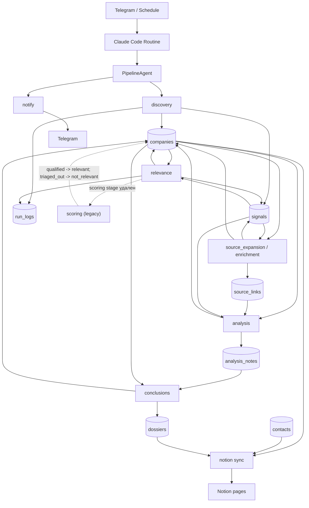
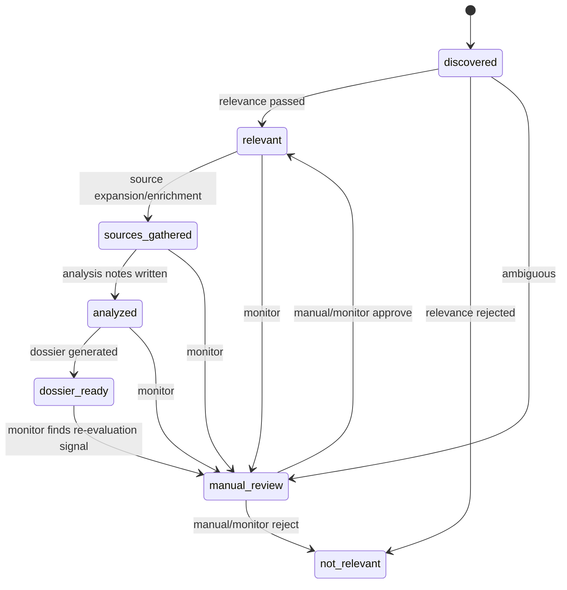

# Аудит базы данных - 2026-06-18

Источник аудита: актуальный baseline `sql/schema.sql`, runtime-код
`scripts/*.py` и `bot/*.py`, prompts `agents/prompts/*.md`, Notion mapping
`config/notion_mapping.yaml`, тесты `tests/*.py`.

Важно: старые test-era миграции удалены полностью. Этот аудит не опирается на
исторические SQL-шаги и рассматривает `sql/schema.sql` как единственный контракт
текущей схемы.

## Краткое резюме

По baseline `sql/schema.sql` актуальный runtime-набор таблиц состоит из семи
таблиц:

- `companies`;
- `signals`;
- `run_logs`;
- `contacts`;
- `source_links`;
- `analysis_notes`;
- `dossiers`.

Из runtime-схемы удалены: `pipeline_runs`, `bot_users`, `bot_dialog_state`,
`bot_presets`, `contact_companies`, `github_org_cache`, `recent_leads`,
`pipeline_stats`. Связь контактов с компаниями теперь канонически идет через
`contacts.company_id -> companies.id`; `contacts.company_domain` оставлен как
переходное совместимое поле.

Главная модель статусов после cleanup:

```text
discovered -> relevant | not_relevant | manual_review
relevant -> sources_gathered -> analyzed -> dossier_ready
manual_review -> relevant | not_relevant
```

Статусы `qualified`, `pending_enrich`, `enriched`, `triaged_out` больше не
являются каноном. При одноразовом live-cleanup эти статусы были смаплены так:
`qualified`, `pending_enrich`, `enriched` -> `relevant`;
`triaged_out` -> `not_relevant`.

Критичные расхождения:

1. `scripts/contact_enricher.py` пишет `email_status = valid/invalid/accept_all`
   из Hunter.io, а SQL разрешает только
   `verified/guessed/bounced/unknown/scraped`.
2. `signals.signal_type` в prompts документирован как `primary_*`,
   `verification_*`, `monitor_*`, но source adapters и `models.SignalType`
   используют базовые значения вроде `github_repo`, `hf_org`, `job_posting`.
3. `run_logs.finished_at` читается Telegram `/status`, но текущие store/prompts
   в основном вставляют новые строки без закрытия ранa; активный ран может
   "зависать".
4. `scripts/notify.py` сохранил старую лексику `score`, `qualified`,
   `hot_leads`, хотя score-поля удалены из БД.
5. `sync_dossiers()` каждый раз append-ит блоки в страницу компании и не
   использует `dossiers.notion_page_id`, поэтому повторный sync дублирует тело
   досье.

## Текущая схема базы данных

### Итоговые таблицы

| Таблица | Назначение | Статус после cleanup |
|---|---|---|
| `companies` | Главная сущность лида и статус pipeline | активна |
| `signals` | Evidence-события и ссылки-основания | активна |
| `run_logs` | Операционный журнал этапов | активна |
| `contacts` | Контакты и ЛПР для DM/outreach | активна |
| `source_links` | URL-источники для анализа | активна |
| `analysis_notes` | Секционные факты и audit notes | активна |
| `dossiers` | Финальное досье по компании | активна |

### Удаленные объекты

| Объект | Статус в baseline | Комментарий |
|---|---|---|
| `pipeline_runs` | отсутствует | Заменен Claude Code Routine и `run_logs` |
| `bot_users` | отсутствует | Бот стал stateless для runtime |
| `bot_dialog_state` | отсутствует | Wizard хранит state в callback payload |
| `bot_presets` | отсутствует | `/presets` и `/quickrun` удалены |
| `contact_companies` | отсутствует | Заменена `contacts.company_id` |
| `github_org_cache` | отсутствует | Cache layer удален |
| `recent_leads` | отсутствует | Нет runtime consumers |
| `pipeline_stats` | отсутствует | Нет runtime consumers |

## Полная схема полей

### `companies`

| Поле | Тип | Обязательное | Дефолт | Использование |
|---|---|---:|---|---|
| `id` | `UUID` | да | `gen_random_uuid()` | PK, FK target для `contacts.company_id` |
| `domain` | `TEXT` | да | нет | Уникальный бизнес-ключ, selector почти всех stages |
| `name` | `TEXT` | да | нет | Имя компании, Notion title |
| `website` | `TEXT` | да | нет | Сайт для relevance/analysis, Notion `Website` |
| `linkedin_url` | `TEXT` | нет | нет | Relevance enrichment, Notion `LinkedIn` |
| `notion_page_id` | `TEXT` | нет | нет | Связка со страницей Notion company |
| `status` | `TEXT` | да | `Researching` | Pipeline state; дефолт устарел |
| `last_signal_date` | `DATE` | нет | нет | Остаточное summary-поле, текущий код почти не использует |
| `last_verified` | `DATE` | нет | нет | Relevance/monitor freshness, stale review |
| `icp_segment` | `TEXT` | нет | нет | Фильтрация stage, Notion `ICP Segment` |
| `funding_stage` | `TEXT` | нет | нет | Relevance/analysis context |
| `funding_amount` | `TEXT` | нет | нет | Подозрительно: есть в SQL, почти не используется |
| `funding_date` | `DATE` | нет | нет | Relevance/analysis context |
| `team_size` | `TEXT` | нет | нет | Relevance/analysis context |
| `created_at` | `TIMESTAMPTZ` | да | `NOW()` | Сортировка discovery/relevance |
| `updated_at` | `TIMESTAMPTZ` | да | `NOW()` | Сортировка очередей, обновляется trigger-ом |
| `source_page_url` | `TEXT` | нет | нет | Подозрительно: добавлено миграцией, prompts/tests теперь запрещают ссылку на него |
| `site_note` | `TEXT` | нет | нет | Краткое объяснение relevance/manual review |
| `website_snippet` | `TEXT` | нет | нет | Аудит quick filter |
| `description` | `TEXT` | нет | нет | Relevance summary, analysis/conclusions |
| `dm_enriched_at` | `TIMESTAMPTZ` | нет | нет | Marker DM enrichment, не входит в основной pipeline |
| `notion_synced_at` | `TIMESTAMPTZ` | нет | нет | Пишется `notion_sync.py` для companies |

Ключи и индексы:

- PK: `id`;
- unique: `domain`;
- `idx_companies_status(status)`;
- `idx_companies_domain(domain)`;
- `idx_companies_manual_review(status) WHERE status = 'manual_review'`;
- `idx_companies_dm_enrichment(status, dm_enriched_at) WHERE status IN (...)`.

Подозрительные индексы:

- `idx_companies_dm_enrichment` в baseline фильтрует актуальные статусы
  `relevant/sources_gathered/analyzed/dossier_ready`.

Удаленные поля:

- `score`;
- `score_bucket`;
- `score_version`;
- `ai_direction`;
- `sources`;
- `latest_signal`;
- `reject_reason`;
- `outreach_status`;
- `outreach_note`.

### `signals`

| Поле | Тип | Обязательное | Дефолт | Использование |
|---|---|---:|---|---|
| `id` | `UUID` | да | `gen_random_uuid()` | PK |
| `source` | `TEXT` | да | нет | Adapter/source name |
| `signal_type` | `TEXT` | да | нет | Тип evidence; naming convention сейчас расходится |
| `company_name` | `TEXT` | да | нет | Имя из source adapter |
| `domain` | `TEXT` | нет | нет | Сырой домен из source adapter |
| `normalized_domain` | `TEXT` | нет | нет | Join к `companies.domain` |
| `linkedin_url` | `TEXT` | нет | нет | Потенциальный enrichment |
| `evidence_url` | `TEXT` | да | нет | Уникальный URL evidence |
| `signal_date` | `DATE` | да | нет | Freshness |
| `confidence` | `TEXT` | да | `medium` | Уровень доверия |
| `parser_version` | `TEXT` | нет | нет | Версия adapter |
| `raw_data` | `JSONB` | да | `{}` | Raw payload |
| `created_at` | `TIMESTAMPTZ` | да | `NOW()` | Audit timestamp |
| `source_page_url` | `TEXT` | нет | нет | Подозрительно: добавлено миграцией, текущий код не использует |

Ключи и индексы:

- PK: `id`;
- unique: `evidence_url`;
- `idx_signals_normalized_domain(normalized_domain)`;
- `idx_signals_signal_date(signal_date DESC)`;
- `idx_signals_signal_type(signal_type)`.

Связи:

- SQL FK нет;
- фактическая soft-связь: `signals.normalized_domain -> companies.domain`.

### `run_logs`

| Поле | Тип | Обязательное | Дефолт | Использование |
|---|---|---:|---|---|
| `id` | `UUID` | да | `gen_random_uuid()` | PK |
| `task_name` | `TEXT` | да | нет | Имя stage |
| `started_at` | `TIMESTAMPTZ` | да | `NOW()` | Время старта/insert |
| `finished_at` | `TIMESTAMPTZ` | нет | нет | Telegram `/status` считает `NULL` активным |
| `companies_found` | `INTEGER` | да | `0` | Stage metric |
| `companies_enriched` | `INTEGER` | да | `0` | Legacy/overloaded metric |
| `errors` | `JSONB` | да | `[]` | Ошибки stage |
| `notes` | `TEXT` | нет | нет | Свободное summary |

Индексы:

- PK: `id`;
- `idx_run_logs_task_name(task_name)`;
- `idx_run_logs_started_at(started_at DESC)`.

### `contacts`

| Поле | Тип | Обязательное | Дефолт | Использование |
|---|---|---:|---|---|
| `id` | `UUID` | да | `gen_random_uuid()` | PK, Notion contact key |
| `company_domain` | `TEXT` | да | нет | Legacy/compatibility key, still conflict key |
| `full_name` | `TEXT` | да | нет | Contact title, dedup |
| `first_name` | `TEXT` | нет | нет | Email guessing |
| `last_name` | `TEXT` | нет | нет | Email guessing |
| `title` | `TEXT` | нет | нет | Role, Notion `Title` |
| `title_normalized` | `TEXT` | нет | нет | DM priority context |
| `dm_priority` | `INTEGER` | да | `2` | Outreach ordering, `CHECK 1..3` |
| `email` | `TEXT` | нет | нет | Notion `Email`, outreach |
| `email_status` | `TEXT` | да | `unknown` | SQL enum: `verified/guessed/bounced/unknown/scraped` |
| `email_source` | `TEXT` | нет | нет | Email provenance |
| `linkedin_url` | `TEXT` | нет | нет | Notion `LinkedIn` |
| `twitter_handle` | `TEXT` | нет | нет | Social enrichment |
| `github_username` | `TEXT` | нет | нет | GitHub enrichment |
| `source_vector` | `TEXT` | да | нет | SQL enum: `github/huggingface/team_page/apollo/wellfound/arxiv/contact_page` |
| `source_url` | `TEXT` | нет | нет | Evidence URL, Notion `Источник` |
| `confidence` | `TEXT` | да | `medium` | SQL enum: `high/medium/low` |
| `raw_payload` | `JSONB` | да | `{}` | Raw source data |
| `created_at` | `TIMESTAMPTZ` | да | `NOW()` | Audit timestamp |
| `updated_at` | `TIMESTAMPTZ` | да | `NOW()` | Trigger-updated timestamp |
| `personal_website` | `TEXT` | нет | нет | Contact enrichment |
| `hf_username` | `TEXT` | нет | нет | HuggingFace enrichment |
| `notion_page_id` | `TEXT` | нет | нет | Связка со страницей Notion contact |
| `contact_type` | `TEXT` | да | `Person` | SQL enum: `Person/Company/Related Person/Other` |
| `phone` | `TEXT` | нет | нет | Notion `Phone` |
| `instagram_url` | `TEXT` | нет | нет | Notion `Instagram` |
| `facebook_url` | `TEXT` | нет | нет | Notion `Facebook` |
| `info` | `TEXT` | нет | нет | Notion `Информация о контакте` |
| `company_id` | `UUID` | да | нет | Canonical FK to `companies.id` |

Ключи, индексы и связи:

- PK: `id`;
- FK: `contacts.company_id -> companies.id`;
- unique expression index: `(company_domain, lower(full_name))`;
- unique index for Supabase upsert: `(company_domain, full_name)`;
- `idx_contacts_company_domain(company_domain)`;
- `idx_contacts_priority(dm_priority, company_domain)`;
- `idx_contacts_email_status(email_status) WHERE email IS NOT NULL`;
- `idx_contacts_source_vector(source_vector)`;
- `idx_contacts_company_id(company_id)`;
- старый `idx_contacts_outreach` должен исчезнуть вместе с
  `contacts.outreach_status`, но это стоит проверить на live DB.

Удаленные поля:

- `outreach_status`;
- `outreach_note`;
- `contact_result`.

### `source_links`

| Поле | Тип | Обязательное | Дефолт | Использование |
|---|---|---:|---|---|
| `id` | `UUID` | да | `gen_random_uuid()` | PK |
| `company_domain` | `TEXT` | да | нет | Soft-связь с `companies.domain` |
| `kind` | `TEXT` | да | нет | Тип источника: `github_org`, `hf_org`, `wayback`, `news_feed` и др. |
| `url` | `TEXT` | да | нет | URL источника |
| `source` | `TEXT` | да | `unknown` | Resolver/provenance |
| `confidence` | `TEXT` | да | `medium` | SQL enum: `high/medium/low` |
| `found_via` | `TEXT` | нет | нет | Дополнительный provenance |
| `raw` | `JSONB` | да | `{}` | Raw resolver payload |
| `fetched_at` | `TIMESTAMPTZ` | да | `now()` | Время сбора |

Ключи и индексы:

- PK: `id`;
- unique: `(company_domain, kind, url)`;
- `idx_source_links_company(company_domain)`;
- `idx_source_links_kind(kind)`.

### `analysis_notes`

| Поле | Тип | Обязательное | Дефолт | Использование |
|---|---|---:|---|---|
| `id` | `UUID` | да | `gen_random_uuid()` | PK |
| `company_domain` | `TEXT` | да | нет | Soft-связь с `companies.domain` |
| `section` | `TEXT` | да | нет | SQL enum: `company/product/collaboration/financials/news/audit` |
| `facts` | `JSONB` | да | `{}` | Структурированные факты |
| `sources` | `JSONB` | да | `[]` | URL и заметки по источникам |
| `confidence` | `TEXT` | да | `medium` | SQL enum: `high/medium/low` |
| `model` | `TEXT` | нет | нет | Модель/agent, создавший note |
| `version` | `TEXT` | да | `v1` | Версия note-схемы |
| `created_at` | `TIMESTAMPTZ` | да | `now()` | Время записи |

Ключи и индексы:

- PK: `id`;
- unique: `(company_domain, section, version)`;
- `idx_analysis_notes_company(company_domain)`.

### `dossiers`

| Поле | Тип | Обязательное | Дефолт | Использование |
|---|---|---:|---|---|
| `company_domain` | `TEXT` | да | нет | PK, soft-связь с `companies.domain` |
| `summary_md` | `TEXT` | нет | нет | Тело досье, append в Notion page |
| `sections` | `JSONB` | да | `{}` | 6 секций досье |
| `audit_md` | `TEXT` | нет | нет | Audit section, append в Notion page |
| `table_fields` | `JSONB` | да | `{}` | Подозрительно: не синхронизируется в Notion mapping |
| `version` | `TEXT` | да | `v1` | Версия досье |
| `generated_at` | `TIMESTAMPTZ` | да | `now()` | Время генерации |
| `notion_page_id` | `TEXT` | нет | нет | Подозрительно: добавлено, но `sync_dossiers()` его не пишет и не читает |

Ключи:

- PK: `company_domain`.

## Каталог таблиц

### `companies`

- Назначение: главный реестр компаний, статус-машина pipeline, минимальный
  профиль лида и Notion binding.
- Пишут: Discovery, Relevance, SourceExpansion/Enrichment, Analysis,
  Conclusions, Monitor, `contacts_store.mark_enriched`, `notion_sync.py`.
- Читают: все stages, `contacts_store.resolve_company_ref`,
  `notion_sync.py`, Telegram routines, bot `/status` indirectly через
  `run_logs`.
- Жизненный цикл: создается в `discovered`, проходит relevance, затем source
  gathering, analysis, dossier, после чего попадает в Notion.
- Обязательные поля: `domain`, `name`, `website`, `status`.
- Notion sync поля: `name`, `icp_segment`, `linkedin_url`, `website`,
  `notion_page_id`, `notion_synced_at`.
- Ручные операторские поля: после cleanup в БД их нет; ручные свойства Notion
  не должны reverse-sync-иться без явного mapping.
- Deprecated/suspicious: `source_page_url`, `last_signal_date`,
  `funding_amount`, дефолт `status = Researching`, индекс на `status='enriched'`.

### `signals`

- Назначение: атомарные evidence-события, которые объясняют, почему компания
  появилась или была переоценена.
- Пишут: source adapters через `SupabaseStore.upsert_signal`, Discovery,
  Relevance, SourceExpansion, Monitor.
- Читают: Relevance/Analysis prompts, `enrichment.GithubOrgResolver`,
  `dm_github.py`, `dm_huggingface_contacts.py`.
- Жизненный цикл: immutable/upsert по `evidence_url`; новые факты добавляются
  отдельными строками.
- Обязательные поля: `source`, `signal_type`, `company_name`, `evidence_url`,
  `signal_date`, `confidence`, `raw_data`.
- Notion sync поля: напрямую не синхронизируются; факты попадают в Notion через
  `dossiers`.
- Ручные операторские поля: нет.
- Deprecated/suspicious: `source_page_url`; расхождение naming convention
  `primary_*`/`verification_*`/`monitor_*` против adapter values.

### `run_logs`

- Назначение: легкий журнал выполнения этапов.
- Пишут: `SupabaseStore.log_run`, SQL snippets в prompts.
- Читают: bot `/status`, bot `/last`; потенциально операционный аудит.
- Жизненный цикл: insert на stage/run; должен закрываться `finished_at`, но
  сейчас это не стандартизовано.
- Обязательные поля: `task_name`.
- Notion sync поля: нет.
- Ручные операторские поля: нет.
- Deprecated/suspicious: `companies_enriched` перегружено по смыслу;
  `finished_at` читается, но почти не пишется.

### `contacts`

- Назначение: контакты/ЛПР для DM и outreach.
- Пишут: `contacts_store.py`, `contact_enricher.py`, DM scripts/prompts,
  потенциально Notion reverse import, если его включить.
- Читают: `contacts_store.list_contacts`, `contact_enricher.py`,
  `notion_sync.py`.
- Жизненный цикл: контакт создается только для существующей компании; перед
  upsert код резолвит `company_id` и `company_domain`; Notion page id пишется
  после forward sync.
- Обязательные поля: `company_id`, `company_domain`, `full_name`,
  `dm_priority`, `email_status`, `source_vector`, `confidence`, `raw_payload`,
  `contact_type`.
- Notion sync поля: `full_name`, `title`, `contact_type`, `email`, `phone`,
  `linkedin_url`, `instagram_url`, `facebook_url`, `source_url`, `info`,
  computed `company_page_ids`.
- Ручные операторские поля: в БД после cleanup нет. Если оператор меняет
  forward-mapped свойства в Notion, следующий forward sync перезапишет их из БД.
- Deprecated/suspicious: `company_domain` transitional; отсутствует
  `notion_synced_at`, хотя generic sync пишет его при создании страницы.

### `source_links`

- Назначение: durable URL-ручки для анализа без интерпретации.
- Пишут: `scripts/enrichment.py`, `scripts/dossier_store.py`,
  SourceExpansion/Enrichment prompts.
- Читают: `analysis_section_task.md`, `dossier_store.get_source_links`.
- Жизненный цикл: upsert по `(company_domain, kind, url)`; может обновляться
  при повторном enrichment.
- Обязательные поля: `company_domain`, `kind`, `url`, `source`, `confidence`,
  `raw`, `fetched_at`.
- Notion sync поля: напрямую нет; используются при генерации `analysis_notes`
  и `dossiers`.
- Ручные операторские поля: нет.
- Deprecated/suspicious: SQL comment упоминает "qualified-компанию", но
  `qualified` больше не канонический статус.

### `analysis_notes`

- Назначение: секционные структурированные факты перед финальным досье.
- Пишут: `analysis_section_task.md`, `analysis_audit_task.md`,
  `dossier_store.upsert_analysis_note`.
- Читают: `conclusions_task.md`, `dossier_store.get_analysis_notes`,
  `notion_sync.sync_dossiers` indirectly через `dossiers`.
- Жизненный цикл: одна строка на `(company_domain, section, version)`;
  повторный анализ перезаписывает версию или должен создать новую версию.
- Обязательные поля: `company_domain`, `section`, `facts`, `sources`,
  `confidence`, `version`.
- Notion sync поля: напрямую нет.
- Ручные операторские поля: нет.
- Deprecated/suspicious: нет явного FK на `companies`; это осознанная soft-связь.

### `dossiers`

- Назначение: финальный markdown/json результат анализа компании.
- Пишут: `conclusions_task.md`, `dossier_store.upsert_dossier`.
- Читают: `notion_sync.sync_dossiers`, `dossier_store.get_dossier`.
- Жизненный цикл: одна строка на компанию; повторный conclusions upsert
  обновляет строку, но Notion append может дублировать блоки.
- Обязательные поля: `company_domain`, `sections`, `table_fields`, `version`,
  `generated_at`.
- Notion sync поля: `summary_md`, `audit_md`, join через
  `company_domain -> companies.notion_page_id`.
- Ручные операторские поля: нет.
- Deprecated/suspicious: `notion_page_id` фактически не используется;
  `table_fields` не отражен в Notion mapping.

## Что хранится где

| Таблица | Что хранится | Producer | Consumer | Retention / lifecycle | Примечания |
|---|---|---|---|---|---|
| `companies` | Компания, статус, ICP, сайт, Notion binding | Discovery/Relevance/Monitor/Notion sync | Все stages, Notion, Telegram, contacts | Долгоживущая строка по `domain` | Нет status check; дефолт устарел |
| `signals` | Evidence URL, source, raw payload, confidence | Source adapters, Relevance, SourceExpansion, Monitor | Relevance, Enrichment, Analysis, DM scripts | Append/upsert по `evidence_url` | Naming convention расходится |
| `run_logs` | Stage metrics, errors, notes | Prompts, `SupabaseStore.log_run` | Bot `/status`, `/last` | Append-only, но должен закрываться | `finished_at` почти не пишется |
| `contacts` | ЛПР, каналы связи, source, relation to company | DM scripts, contact enricher, contacts_store | Notion contacts, outreach tooling | Upsert по company/name | `company_id` канонический |
| `source_links` | Durable URLs для анализа | Enrichment resolvers, prompts | Analysis sub-agents | Upsert по company/kind/url | Нет интерпретации, только provenance |
| `analysis_notes` | Факты по секциям и audit | Analysis sub-agents | Conclusions | Upsert по company/section/version | Содержит claims/facts/sources |
| `dossiers` | Итоговое досье markdown/json | Conclusions | Notion sync | Upsert по company | Повторный Notion append дублирует блоки |

## Поток данных pipeline



### Discovery

- Входные статусы: не требует входного статуса; работает от source adapters и
  dedup по `companies.domain`.
- Читает: `config/icp.yaml`, source adapters, `companies` для dedup/fuzzy dedup.
- Пишет: `companies(status='discovered')`, `signals(primary evidence)`,
  `run_logs`.
- Артефакты: новые company rows, primary evidence signals.
- Ошибки: должны попадать в `run_logs.errors` и финальное уведомление.
- Риски: adapters возвращают базовые `signal_type`, а prompts требуют prefix
  `primary_*`.

### Relevance

- Входные статусы: `discovered`.
- Читает: `companies`, `signals`, website/search/HF/jobs/funding.
- Пишет: `companies.status` в `relevant`, `not_relevant` или `manual_review`;
  `description`, `linkedin_url`, `team_size`, `funding_stage`, `funding_date`,
  `website_snippet`, `site_note`, `last_verified`; `signals(verification_*)`;
  `run_logs`.
- Артефакты: decision per company, supporting verification signals.
- Ошибки: `run_logs.errors`, уведомления через `notify.py`.
- Зависания: `manual_review` не движется дальше без ручного решения или monitor.

### Scoring

- Текущий статус: stage удален.
- Старые статусы: `qualified`, `triaged_out`.
- Миграция: `qualified -> relevant`, `triaged_out -> not_relevant`.
- Поля: `score`, `score_bucket`, `score_version`, `ai_direction` удалены.
- Остатки: `scripts/notify.py` и старые docs/reports еще используют слова
  `score` и `qualified`.

### Source expansion / Enrichment

- Входные статусы: `relevant`.
- Читает: `companies`, `signals`.
- Пишет: `source_links`, дополнительные `signals(verification_*)`,
  `companies.status = 'sources_gathered'`.
- Артефакты: durable source URLs для анализа.
- Ошибки: resolver errors логируются как warnings; stage-level ошибки должны
  попадать в summary/run_logs.
- Зависания: если запустить только `enrichment` после `source_expansion`,
  часть компаний уже будет `sources_gathered`; `pipeline_main_task.md` разрешает
  пропустить их или добавить недостающие ссылки.

### Analysis

- Входные статусы: `sources_gathered`.
- Читает: `companies`, `signals`, `source_links`.
- Пишет: `analysis_notes`, `companies.status = 'analyzed'`.
- Артефакты: секции `company`, `product`, `collaboration`, `financials`,
  `news`, `audit`.
- Ошибки: должны попадать в stage summary; SQL-слой сам не хранит traceback
  кроме `run_logs.errors`.
- Зависания: если не все section notes созданы, `conclusions` может собрать
  неполное досье, потому SQL не валидирует наличие всех секций.

### Conclusions

- Входные статусы: `analyzed`.
- Читает: `analysis_notes`, `companies`.
- Пишет: `dossiers`, `companies.status = 'dossier_ready'`.
- Артефакты: `summary_md`, `sections`, `audit_md`.
- Ошибки: Notion sync errors считаются отдельно внутри `notion_sync.py`.
- Риск: повторный Notion sync append-ит блоки без замены старого досье.

### Notion sync

- Входные статусы компаний: `relevant`, `sources_gathered`, `analyzed`,
  `dossier_ready`.
- Читает: `companies`, `contacts`, `dossiers`.
- Пишет: Notion pages; в БД пишет `notion_page_id` и для companies
  `notion_synced_at`.
- Артефакты: Notion database pages и блоки досье на странице компании.
- Ошибки: возвращаются counters `errors`, логируются через logger.
- Риски: concurrent sync может создать дубликаты страниц, потому create
  идемпотентен только при уже заполненном `notion_page_id`.

### Notify

- Входные данные: structured summary от pipeline/stage.
- Читает/пишет БД: напрямую не пишет, но bot routines читают
  `companies/run_logs`.
- Артефакты: Telegram сообщения.
- Риски: `scripts/notify.py` все еще ожидает `score`/`qualified` в старых
  helper-ах.

## State machine `companies.status`



| Статус | Реально используется | Источник | Дальше идет | В Notion | Комментарий |
|---|---:|---|---|---:|---|
| `discovered` | да | `models.ALL_STATUSES`, prompts | `relevant/not_relevant/manual_review` | нет | Discovery output |
| `relevant` | да | `models`, prompts, Notion filter | `sources_gathered`, optional contacts | да | Каноническая замена старого `qualified/enriched` |
| `not_relevant` | да | `models`, prompts, migration | terminal или manual revisit | нет | Старый `triaged_out` мапится сюда |
| `manual_review` | да | `models`, prompts, monitor | `relevant/not_relevant` | нет | Может зависнуть без оператора |
| `sources_gathered` | да | prompts | `analyzed` | да | После source expansion/enrichment |
| `analyzed` | да | prompts | `dossier_ready` | да | После `analysis_notes` |
| `dossier_ready` | да | prompts | terminal/monitor | да | Финальный статус для Notion |
| `qualified` | нет, legacy | old scoring | live-cleanup -> `relevant` | нет | Удален из `ALL_STATUSES` |
| `triaged_out` | нет, legacy | old scoring | live-cleanup -> `not_relevant` | нет | Удален из `ALL_STATUSES` |
| `pending_enrich` | нет, legacy | old enrichment | live-cleanup -> `relevant` | нет | Удален |
| `enriched` | нет, legacy | old enrichment/DM | live-cleanup -> `relevant` | нет | Удален |
| `new` | нет, legacy/test fixture | tests fake data | нет | нет | Встречается в `tests/test_telegram_routines.py` fixtures |
| `Researching` | нет, legacy default | старый bootstrap | не определен | нет | В baseline default `discovered` |

Где возможны зависшие компании:

- `Researching`, если строку вставили без явного `status`;
- `discovered`, если relevance stage не запускался или упал;
- `manual_review`, если нет ручного процесса возврата в `relevant/not_relevant`;
- `relevant`, если запускали `source_expansion` и `enrichment` раздельно и оба
  пропустили запись;
- `sources_gathered`, если analysis создал не все секции и не перевел статус;
- `analyzed`, если `conclusions` или Notion sync упали до смены статуса;
- `dossier_ready`, если Notion page не создан из-за sync errors.

## Контракт Notion sync

### Companies

`config/notion_mapping.yaml` синхронизирует только:

| DB поле | Notion property | Направление |
|---|---|---|
| `name` | `Company name` | forward |
| `icp_segment` | `ICP Segment` | forward |
| `linkedin_url` | `LinkedIn` | forward |
| `website` | `Website` | forward |

Фильтр строк:

```yaml
db_status_filter: [relevant, sources_gathered, analyzed, dossier_ready]
```

Текущий смысл: Notion получает только компании, которые прошли первичную
релевантность. `discovered`, `not_relevant`, `manual_review` не попадают в
Notion.

Reverse fields для companies отсутствуют. Удаленные ручные поля
`outreach_status` и `outreach_note` не должны возвращаться без нового
осознанного контракта.

### Contacts

Forward fields:

| DB поле | Notion property | Комментарий |
|---|---|---|
| `full_name` | `Name` | title |
| `title` | `Title` | rich text |
| `contact_type` | `Тип контакта` | select |
| `email` | `Email` | email |
| `phone` | `Phone` | phone |
| `linkedin_url` | `LinkedIn` | url |
| `instagram_url` | `Instagram` | url |
| `facebook_url` | `Facebook` | url |
| `source_url` | `Источник` | url |
| `info` | `Информация о контакте` | rich text |
| computed `company_page_ids` | `Компании` | relation через `company_id -> companies.notion_page_id` |

Reverse fields для contacts в текущем mapping отсутствуют. Код reverse import
умеет создавать контакты из Notion при наличии reverse mapping, но текущая SQL
схема требует `source_vector`; без default или reverse-mapped value такой import
будет падать в live DB.

### Dossiers

`--entity dossiers` не использует generic forward mapping. Он:

- читает `dossiers`;
- находит `companies.notion_page_id` по `dossiers.company_domain`;
- append-ит `summary_md` и `audit_md` как блоки на страницу компании.

Проблемы:

- `dossiers.notion_page_id` не обновляется;
- `notion_synced_at` для dossiers отсутствует;
- повторный sync дублирует блоки.

## Несоответствия между SQL, кодом, prompts и тестами

### Поля есть в SQL, но не используются или используются слабо

| Таблица | Поле | Наблюдение |
|---|---|---|
| `companies` | `source_page_url` | Добавлено миграцией, но prompt-тесты теперь запрещают `source_page_url`; runtime не читает |
| `companies` | `last_signal_date` | После удаления `latest_signal` почти не используется; evidence должен выводиться из `signals` |
| `companies` | `funding_amount` | Есть в SQL, но current prompts/code работают в основном с `funding_stage/funding_date` |
| `companies` | `dm_enriched_at` | Пишется marker-ом, но основной pipeline не запускает `dm_enrich_task` |
| `signals` | `source_page_url` | Добавлено миграцией, текущий enrichment/DM используют `evidence_url` |
| `dossiers` | `notion_page_id` | Добавлено, но `sync_dossiers()` не читает и не пишет |
| `dossiers` | `table_fields` | Записывается в dossier payload, но Notion sync его не публикует |

### Код использует значения или поля, которых нет в SQL-контракте

| Код | Проблема | Последствие |
|---|---|---|
| `notion_sync.sync_forward()` | При create любой entity пишет `notion_synced_at`; в `contacts` такой колонки нет | Forward sync новых contacts может падать |
| `contact_enricher.run_hunter_verify()` | Пишет `email_status = valid/invalid/accept_all`, SQL их запрещает | Upsert контакта после Hunter.io может падать |
| `notify_hot_lead()` / `notify_pipeline_summary()` | Ожидают `score` и `qualified`, которых нет в БД | Старые уведомления вводят в заблуждение |
| `signals.signal_type` convention | Prompts требуют prefixed values, adapters/models дают базовые values | Непредсказуемая фильтрация и analytics по signal_type |

### Объекты, удаленные из baseline

- `pipeline_runs`;
- `bot_users`;
- `bot_dialog_state`;
- `bot_presets`;
- `contact_companies`;
- `github_org_cache`;
- `recent_leads`;
- `pipeline_stats`.

Эти объекты не входят в `sql/schema.sql` и не должны появляться в runtime-коде,
prompts или конфигурации.

### Prompt-инструкции со старым смыслом

- `enrichment_task.md` и `source_expansion_task.md` актуальны по статусам.
- `discover_verify_task.md` явно помечен как устаревший.
- `pipeline_main_task.md` все еще содержит stage `enrichment` отдельно от
  `source_expansion`, оба выбирают `status='relevant'` и оба могут ставить
  `sources_gathered`. Это допустимо, но нужно считать их одним logical gate или
  определить порядок владения статусом.

### Тесты, которые не отражают реальное поведение

| Тест | Проблема |
|---|---|
| `tests/test_contact_enricher.py` | Ожидает `email_status = valid/invalid`, хотя SQL после cleanup такие значения запрещает |
| `tests/test_migrations.py` | Проверяет baseline-контракт `sql/schema.sql`, а не историю старых SQL-шагов |
| `tests/test_telegram_routines.py` | FakeStore использует `new` и `enriched`, которых нет в `ALL_STATUSES` |
| `tests/conftest.py` | Докстринг все еще упоминает `from score import score`, хотя scoring удален |
| `tests/test_notion_sync.py` | Проверяет custom reverse contact import без учета обязательного `source_vector` в live SQL |

### Потенциальные race conditions и дубли

1. Два параллельных `notion_sync.py --entity companies --all` могут оба увидеть
   `notion_page_id IS NULL` и создать две страницы Notion для одной компании.
2. То же применимо к contacts.
3. `sync_dossiers()` append-ит блоки при каждом запуске, поэтому повторный sync
   создает дубли тела досье.
4. `run_logs` без закрытия `finished_at` может оставлять "активный" ран навсегда.
5. `signals` dedup только по `evidence_url`; если один URL относится к нескольким
   компаниям или был неправильно нормализован, второй сигнал будет потерян.
6. `contacts` upsert по `(company_domain, full_name)` может создать дубль, если
   домен компании изменился, хотя `company_id` остался тем же.

## Рекомендованные изменения

### Must fix

1. Исправить `contacts` forward sync:
   - либо добавить `contacts.notion_synced_at TIMESTAMPTZ`;
   - либо в `notion_sync.sync_forward()` писать `notion_synced_at` только для
     таблиц, где поле реально есть.
2. Нормализовать Hunter.io statuses:
   - `valid -> verified`;
   - `invalid -> bounced`;
   - `accept_all -> guessed` или `unknown` по выбранной политике.
3. Исправить SQL default `companies.status` на `discovered` и добавить
   `CHECK (status IN (...))`.
4. Удалить или пересоздать `idx_companies_dm_enrichment`, потому он фильтрует
   legacy `enriched`.
5. Уточнить контракт `signals.signal_type`: либо хранить prefix в коде, либо
   убрать prefix-требование из prompts/docs и хранить stage отдельно.

### Should fix

1. Добавить явный lifecycle для `run_logs`: create/update with `finished_at`,
   stage status и summary.
2. Сделать Notion forward create идемпотентным не только через
   `notion_page_id`, но и через поиск страницы по уникальному ключу
   (`domain`/`id`) перед create.
3. Сделать `sync_dossiers()` заменяющим или версионированным, а не append-only.
4. Развести `source_expansion` и `enrichment`: один stage должен владеть
   переводом `relevant -> sources_gathered`.
5. Обновить `scripts/notify.py` под новую модель без `score/qualified`.

### Cleanup

1. Удалить или задокументировать `companies.source_page_url` и
   `signals.source_page_url`.
2. Удалить `dossiers.notion_page_id`, если не планируется отдельная страница
   досье.
3. Удалить устаревшие references в тестовых fixtures: `new`, `enriched`,
   `score`.
4. Поддерживать `sql/schema.sql` как единственный контракт текущей схемы.

### Optional

1. Добавить материализованную или SQL view для latest signal, если UI/Notion
   снова понадобится human-readable latest evidence.
2. Добавить `companies.status_changed_at` для SLA и зависших очередей.
3. Добавить `analysis_notes.updated_at` или version bump policy.
4. Добавить `contacts.company_id, lower(full_name)` unique index как более
   канонический dedup key.

## План cleanup

1. Исправить `contact_enricher.py` и тесты под SQL enum `email_status`.
2. Исправить `notion_sync.py` и добавить тест на `sync_forward("contacts")` при
   создании новой страницы.
3. Уточнить и зафиксировать `signals.signal_type` convention в `models.py`,
   source adapters и prompts.
4. Обновить `notify.py` и тестовые fixtures без `score/qualified/enriched/new`.
5. Поддерживать smoke-test baseline-схемы: финальный список таблиц,
   финальный список columns, отсутствие удаленных объектов.

## Пробелы в тестовом покрытии

- Нет исполняемого SQL smoke-test, который применяет `sql/schema.sql` к
  временному Postgres и проверяет финальный set таблиц/колонок.
- Нет теста `notion_sync` для forward contacts create с реальными колонками
  `contacts`.
- Нет теста на SQL-compatible normalization Hunter statuses.
- Нет теста на запрет неканонических `companies.status` в SQL.
- Нет теста, что `run_logs.finished_at` закрывается в нормальном stage flow.
- Нет теста на отсутствие duplicate append в `sync_dossiers()`.
- Нет теста, который сверяет `config/notion_mapping.yaml` с реальными SQL
  колонками.
- Нет теста, который сверяет `models.ALL_STATUSES`, prompt status names и SQL
  status check в одном месте.

## Итог

Схема после cleanup стала существенно проще: основной pipeline больше не
зависит от score-таблиц/полей и старых bot runtime tables. Канонические данные
разложены правильно: identity/status в `companies`, evidence в `signals`,
analysis inputs в `source_links`, facts в `analysis_notes`, финальный результат
в `dossiers`, контакты в `contacts`.

Главные оставшиеся проблемы не в размере схемы, а в контрактных мелочах:
неканонический SQL default статуса, отсутствующий `contacts.notion_synced_at`
при generic sync, несовместимые email statuses Hunter.io, старая лексика
уведомлений и отсутствие защиты Notion sync от дублей.
